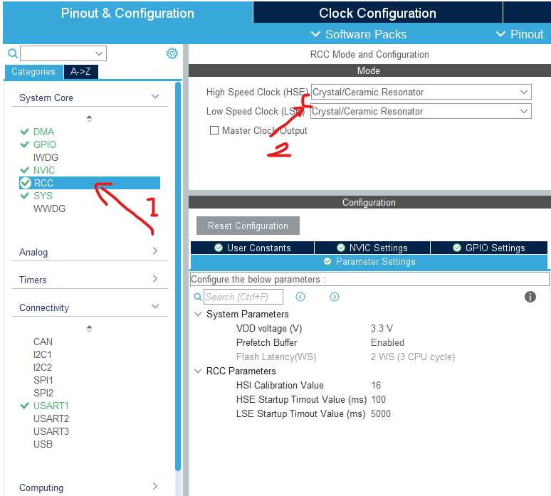

# CubeMX配置最小Keil工程

## 1,  芯片选型

## 2,   配置RCC外部时钟

**BYPASS Clock Resource：外部有源晶振（旁路时钟源）
Crystal/Ceramic Resonator:外部无源晶振（陶瓷晶振）**

我们一般选用外部无源晶振

无源晶振无需外部供电。有源晶需要外部供电，由一个引脚输出固定频率波形。

  

## 3,   SYS系统配置

最常见的的就是使用Serial Wire Debug（SWD）协议，我们就是使用该协议给单片机烧录,调试的。

Timebase Source 系统时钟源配置，如果不用FreeRTOS，我们默认SysTick就好

  

## 4,   时钟树配置

直接输入最大频率然后回车即可，剩下的CubeMX会自动帮你配置好

    

## 5,  工程配置

###  Project

取一个工程名-->>选择工程存储的位置（ **注意必须都要是英文** ）

我们用keil5编写代码，所以工具链选择MDK-ARM，版本选择最新的即可

   

### Code Generator 代码生成器

在MCU package中选择 Copy only the necessary library files，只复制必要的库文件，避免复制过多不用的文件

然后在Generated files 中勾选如下两项即可，第一项为每个工程文件都生成.c.h文件不要选，实测中发现你在main.c中调用别的库函数时可能会报错。

  

## 6,   Generate

最后generate就可以成功在keil中编译烧录了

## 7,  添加功能

后续如果需要添加引脚功能，只需在工程文件夹中打开.ioc文件即可，以上的配置都无需再次更改。

   

